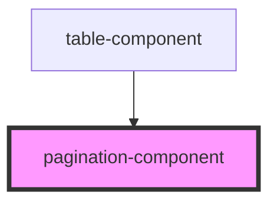

# pagination-component

<!-- Auto Generated Below -->

## Properties

| Property             | Attribute              | Description | Type     | Default     |
| -------------------- | ---------------------- | ----------- | -------- | ----------- |
| `changePage`         | `change-page`          |             | `any`    | `undefined` |
| `currentPage`        | `current-page`         |             | `number` | `undefined` |
| `getPaginationGroup` | `get-pagination-group` |             | `any`    | `undefined` |
| `goToNextPage`       | `go-to-next-page`      |             | `any`    | `undefined` |
| `goToPreviousPage`   | `go-to-previous-page`  |             | `any`    | `undefined` |
| `pages`              | `pages`                |             | `number` | `undefined` |

## Dependencies

### Used by

 - [table-component](../table-component)

### Graph

----------------------------------------------

*Built with [StencilJS](https://stenciljs.com/)*
