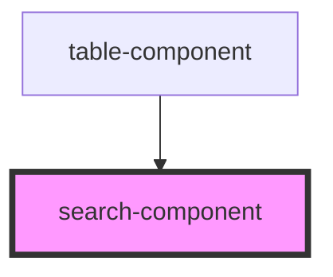

# search-component

<!-- Auto Generated Below -->

## Properties

| Property         | Attribute          | Description | Type  | Default     |
| ---------------- | ------------------ | ----------- | ----- | ----------- |
| `setDefaultData` | `set-default-data` |             | `any` | `undefined` |
| `updateList`     | `update-list`      |             | `any` | `undefined` |

## Dependencies

### Used by

 - [table-component](../table-component)

### Graph

----------------------------------------------

*Built with [StencilJS](https://stenciljs.com/)*
