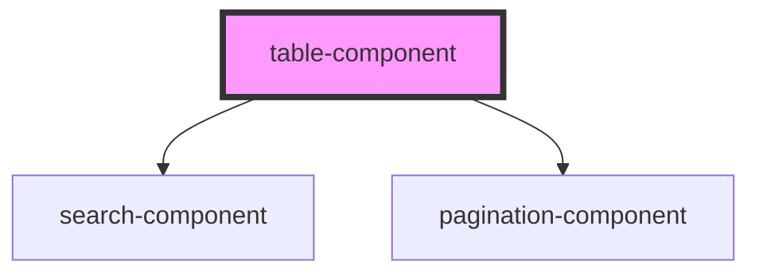

# my-component

<!-- Auto Generated Below -->

## Properties

| Property         | Attribute         | Description | Type     | Default     |
| ---------------- | ----------------- | ----------- | -------- | ----------- |
| `currentPage`    | `current-page`    |             | `number` | `1`         |
| `data`           | `data`            |             | `any`    | `undefined` |
| `invokeCallback` | `invoke-callback` |             | `any`    | `undefined` |
| `limit`          | `limit`           |             | `number` | `undefined` |
| `tHeads`         | --                |             | `any[]`  | `[]`        |
| `total`          | `total`           |             | `number` | `undefined` |

## Dependencies

### Depends on

- [search-component](../search-component)
- [pagination-component](../pagination-component)

### Graph

----------------------------------------------

*Built with [StencilJS](https://stenciljs.com/)*
